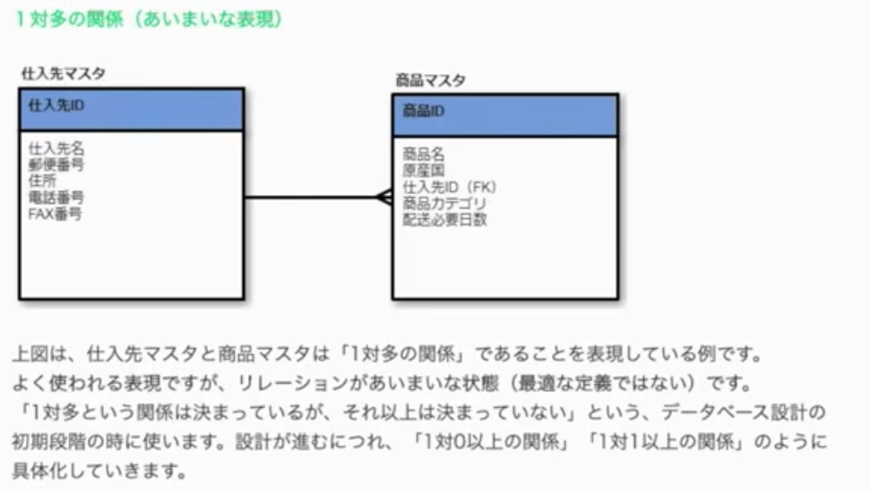
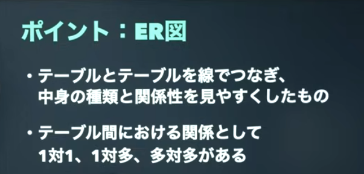
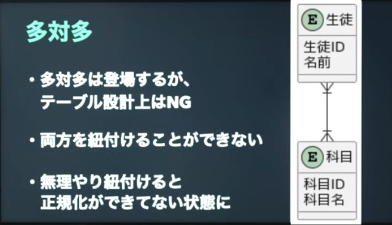
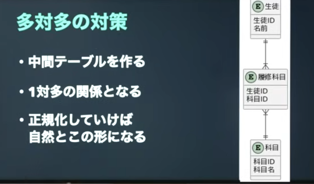

# sql查缺补漏

## mac中如果用homebrew安装mysql的话 无密码
**相关说明**

[具体教程](https://www.sjkjc.com/mysql/install-on-macos/)

brew install mysql

brew services start mysql

**mysql_secure_installation 这个暂时没有弄**

用客户端连接服务端
mysql -u root -p 

MacBook-Air:~ xuyaochen$ mysql -u root -p 
Enter password: 
Welcome to the MySQL monitor.  Commands end with ; or \g.
Your MySQL connection id is 9
Server version: 9.5.0 Homebrew

Copyright (c) 2000, 2025, Oracle and/or its affiliates.

Oracle is a registered trademark of Oracle Corporation and/or its
affiliates. Other names may be trademarks of their respective
owners.

Type 'help;' or '\h' for help. Type '\c' to clear the current input statement.

mysql> 

- brew services start mysql: 启动 MySQL 服务器，并设置为自启动。
- brew services stop mysql: 停止 MySQL 服务器，并设置为不自启动。
- brew services run mysql: 只启动 MySQL 服务器。
- mysql.server start: 启动 MySQL 服务器。
- mysql.server stop: 停止 MySQL 服务器。


show tables;

B站 sql教程

https://zhuanlan.zhihu.com/p/222865842

## 临时表

https://www.bilibili.com/video/BV1sS4y1k74M/?spm_id_from=333.337.search-card.all.click&vd_source=4fd29620ab97a080af7ee392e19b0fcb

student 学生表 (学多, 似名, 此别.) 
选课关系表 (学号, 课程号, 成烫) 
204289
课程表 (深癣号, 洪癣名, 成须) 

当我们感觉到难的时候 其实是我们缺少中间数据

--临时表
with t1 as (
    select * from student as s,s_course as sc,course as c where s.sno = sc.sno and sc.cno = c.cno and c.name = "java基础"
),
t2 as (
    select * from student as s,s_course as sc,course as c where s.sno = sc.sno and sc.cno = c.cno and c.name = "高等数学"
)
--有了上面的临时表之后
select * from t1,t2 where t1.sno = t2.sno and t1.mark > t2.mark

**使用临时表做思路上的拆解**

## 插入

[sql的插入相关教程](sjkjc.com/mysql/insert/)

INSERT INTO `products` VALUES (2,'Pork - Bacon,back Peameal',49,4.65);

Insert:insert into 列名 值
delete: delete from 表＋条件
单表删除：where, orderby
多表删除：连接后用另一表的条件
Update:update 表 set 列名=新值

**插入单行**
INSERT into customers(
	address,
    city,
    state,
    last_name,
    first_name,
    birth_date) 
VALUES(
'5225 Figueroa Mountain Rd',
'Los Olivos',
'CA',
'Jackson',
'michael',
'1958-08-29'
)

**插入多行**

```
INSERT into shippers(name)
values('shipper1'),
	('shipper2'),
    ('shipper3');
```
练习

```
insert into products(name,quantity_in_stock,unit_price)
 values('product1',1,10),
 ('product2',2,20),
 ('product3',3,30);
```

**插入分级行**

意思就是 插入数据时 插入分层行

案例：
新增一个订单（order），里面包含两个订单项目/两种商品（order_items），请同时更新订单表和订单项目表

```sql
USE sql_store;
INSERT INTO orders (customer_id, order_date, status)
VALUES (1, '2019-01-01', 1);
-- 可以先试一下用 SELECT last_insert_id() 看能否成功获取到的最新的order_id
 select last_insert_id();

INSERT INTO order_items -- 全是必须字段，就不用指定了
VALUES
(last_insert_id(), 1, 2, 2.5),
(last_insert_id(), 2, 5, 1.5)
```

## 创建表的副本

**运用 CREAT TABLE 新表名 AS 子查询 快速创建表 orders 的副本表 orders_archived**

```sql
 create table orders_archived as
	select * from orders;
```

- SELECT * FROM orders 选择了 oders 中所有数据，作为AS的内容，是一个子查询
- 子查询： 任何一个充当另一个SQL语句的一部分的 SELECT…… 查询语句都是子查询，子查询是一个很有用的技
巧。

不再 用 全 部 数 据 ， 而 选 用 原 表 中 部 分 数 据 创 建 副 本 表 ， 如 ， 用 今 年 以 前 的 orders 创 建 一 个 副 本 表
orders_archived，其实就是在子查询里增加了一个WHERE语句进行筛选。注意要先 drop 删掉 或 truncate 清
空掉之前建的 orders_archived 表再重建或重填。

```sql
drop table orders_archived;
 create table orders_archived as
	select * from orders
	where order_date<'2019-01-01';
```

delete 是删除表中的数据, 我们可以选择删除部分数据或者全部数据, delete 删除的数据
是可以回滚的, 
delete 操作并不是真的把数据删除掉了, 而是给数据打上删除标记, 目的是
为了空间复用, 所以 delete 删除表数据, 磁盘文件的大小是不会缩减的。

drop 是删除表结构和表中所有的数据, truncate 是只删除表中所有的记录, 表结构并不会
被删除, drop 和 truncate 删除的数据都是不可以回滚的, 并且删除表会立刻释放磁盘空间

从删除表的性能来看，drop（真的都删） > truncate（只删记录） > delete （不删）

**练习**


```sql
DROP TABLE invoices_archived;
CREATE TABLE invoices_archived AS
SELECT i.invoice_id, c.name AS client, i.payment_date
-- 为了简化，就选这三列
FROM invoices i
JOIN clients c
USING (client_id)
【WHERE i.payment_date IS NOT NULL】
-- 或者 i.payment_total > 0

```

## USING 的基本作用

USING 用于 当两张表中存在“同名连接列”时，代替 ON table1.col = table2.col 的写法。

SELECT ...
FROM table1
JOIN table2
USING (column_name);

等价于

FROM table1
JOIN table2
ON table1.column_name = table2.column_name;


## 更新单行

UPDATE 表
【SET 要修改的字段 = 具体值/NULL/DEFAULT/列间数学表达式】 （【修改多个字段用逗号分隔】）
WHERE 行筛选

USE sql_invoicing;
UPDATE invoices
SET
payment_total = 100 / 0 / DEFAULT / NULL / 0.5 * invoice_total,
-- 【注意 0.5 * invoice_total 的结果小数被舍弃，之后讲数据类型会讲到这个问题】
payment_date = '2019-01-01' / DEFAULT / NULL / due_date
WHERE invoice_id = 3

update invoices
set 
	payment_total = 10, payment_date = '2019-01-03'
    where invoice_id = 1;

## 更新多行

**语法一样的，就是让 WHERE…… 的条件包含更多记录，就会同时更改多条记录了**

Workbench默认开启了Safe Updates功能，不允许同时更改多条记录，要先关闭该功能（在 Preference——
SQL Editor 里）

USE sql_invoicing;
UPDATE invoices
SET payment_total = 233, payment_date = due_date
WHERE client_id = 3 -- 该客户的发票记录不止一条，将同时更改
/WHERE client_id IN (3, 4) -- 第二章 4~9 讲的那些写 WHERE 条件的方式当然都可以用
-- 甚至可以直接省略 WHERE 语句，会直接更改整个表的全部记录

练习

```sql
update customers
set points = points + 50 --set中使用了表达式
where birth_date <'1990-01-01';
``` 

## 在update中 使用子查询

```sql
update customers
set points = points + 50 --set中使用了表达式
where client_id = (
    select client_id 
    from clients
    where name = 'myworks'
);
``` 

```sql
update customers
set points = points + 50 --set中使用了表达式
where client_id IN (
    select client_id 
    from clients
    where state IN ('ca','ny')
);
``` 
使用 in 关键字  ：判断字段是否属于某些值

IN …… 后除了可接 （……, ……） 也可接由子查询得到的多个数据（一列多条数据）

SELECT *
FROM employees
WHERE dept_id IN (1, 3, 5);

等价于

WHERE dept_id = 1
   OR dept_id = 3
   OR dept_id = 5;


## DB設計　

https://www.youtube.com/watch?v=T6g-DLWHscw&pp=ygUV5pel5pys6ZaL55m644CAZS1y5Zuz


【2021年版】データベース＋SQL入門

https://www.youtube.com/watch?v=IiX6J0FfGng&list=PL-1KBX2gDRujQaRgEByueezHBiqHP8KDD

## E-R图相关 

cola君说很重要
https://www.youtube.com/watch?v=T6g-DLWHscw&list=PL-1KBX2gDRujQaRgEByueezHBiqHP8KDD&index=2



[若手プログラマー必読！５分で理解できるER図の書き方５ステップ](https://it-koala.com/entity-relationship-diagram-1897)

要记住的

テーブル
からむ　：关系 == アトリビュート （但是不用这个词语）

アトリビュート = 属性 / 特性 / 特征 attribute

👉 指某个对象所具有的性质或字段

二、不同场景下的意思（很重要）
1️⃣ IT / 编程 / 数据库（最常见）
在你现在学的 SQL / 数据库语境中：
アトリビュート = 字段 / 列（column / field）
例如：
用户表中的 age
题目表中的 difficult_level
用户的 gender
📌 日语里常说：
ユーザーのアトリビュート
データのアトリビュート


５．３．エンティティをマスタ系とトランザクション系に分ける
データは、大きく「マスタ系」と「トランザクション系」に分かれます。アトリビュートを洗い出す前に、マスタ系とトランザクション系に整理しておきましょう。マスタ系とトランザクション系を整理する過程で、エンティティが合体することもよくあります。例えば、下図では「お届け先」「請求先」「配送方法」「決済方法」が、トランザクションとして１つのエンティティになりそうです。

5.3. 将实体分为主实体和事务实体
数据大致可以分为“主数据”和“事务数据”两类。在识别属性之前，需要先将数据整理成主数据和事务数据两类。在整理主数据和事务数据的过程中，实体之间经常会发生合并。例如，在下图所示的例子中，“收货地址”、“账单地址”、“配送方式”和“支付方式”很可能合并成一个事务实体。

sql安智パタン

アンチパターン　：反面教材 anti-pattern


E-R 图（ER図）系统介绍（偏对日开发）
一、什么是 E-R 图（ER図）

E-R 图（Entity–Relationship Diagram）
是一种 用于数据库概念设计 的图形化工具，用来描述：

系统中有哪些 实体（Entity）

实体有哪些 属性（Attribute）

实体之间存在什么 关系（Relationship）

📌 在对日开发中常见叫法：

ER図（イーアールず）

概念ER図 / 論理ER図

有时也叫 データモデル

---
二、E-R 图的三大核心要素
1️⃣ 实体（Entity／エンティティ）

👉 现实世界中可以独立存在的对象

例子	说明
用户	人
商品	物
订单	业务对象
学生	管理对象

2️⃣ 属性（Attribute／アトリビュート）

👉 实体所具有的特征

属性类型	说明
主键	唯一标识实体
普通属性	描述信息
可为空	NULL
不可为空	NOT NULL

3️⃣ 关系（Relationship／リレーション）

👉 实体与实体之间的关联

关系	示例
一对一（1:1）	人 ↔ 身份证
一对多（1:N）	用户 ↔ 订单
多对多（M:N）	学生 ↔ 课程

四、E-R 图的三种层次（非常重要）
1️⃣ 概念 ER 图（概念ER図）

面向 业务

不考虑数据库实现

用于和 日方确认需求

📌 特点：

不写字段类型

不写主键实现方式

2️⃣ 逻辑 ER 图（論理ER図）⭐（最常用）

明确：

主键

外键

表结构

不绑定具体数据库

📌 对日开发中 最常被要求的就是这一层

3️⃣ 物理 ER 图（物理ER図）

和 MySQL / Oracle / PostgreSQL 强绑定

明确：

varchar / int

索引

NOT NULL





対策
中間テーブルをつく




カーディナリティ【cardinality】

🔥 基数（Cardinality）和关系的分类：

在数据库中，卡尔迪纳尔数主要用来描述两个实体之间的 关系 的 基数（即关系的数量关系）。我们可以通过卡尔迪纳尔数来区分关系的类型，具体分为以下几类：

1. 一对一关系（1:1）

描述：每个实体在两者之间只能有一个对应的关系。

例子：一个 用户 对应一个 身份证。

ユーザー 1 —— 1 身分証

2. 一对多关系（1:N）

描述：一个实体和另一个实体之间是 一对多 的关系。

例子：一个 作者 可以有多本 书，但是一本书只有一个作者。

作者 1 —— N 本

3. 多对多关系（M:N）

描述：两个实体之间互相是 多对多 的关系。

例子：一个 学生 可以参加多门 课程，同时一门课程也可以有多个学生。

学生 N —— M 课程


👉 这种多对多关系通常会通过 中间表 来实现。

度合い　 程度 分寸


データモデリング（Data Modeling）是 分析、设计 和 构建数据库 结构的过程，目的是：

描述 数据间的关系

定义 数据的结构

确保 数据的完整性和一致性

在数据库管理系统（DBMS）中，数据模型是确保数据在存储、处理和查询时能正确、有效地运作的基础。


紐づく”（ひもづく，himoduku）是一个 日语动词，意思是 “绑定”、“关联” 或 “连接”。这个词通常用来表示某个事物与另一个事物之间的联系或依赖关系。

枠線（わくせん）在日语中的发音是 “waku-sen”，意思是 “边框线” 或 “框线”，常用于描述图形、表格等中的 边框 或 线条。

枠線

“大枠”（おおわく，ōwaku）是一个日语词汇，意思是 “大框架”、“大致框架”，通常用来表示 整体的框架 或 大致的结构，而不是细节。它通常用于描述事物的宏观结构，强调的是一个整体的框架或概念，而非具体细节。

“システムシナリオ”（System Scenario）是由英文单词 “System” 和 “Scenario” 组成的外来语，指的是描述 系统操作流程 或 系统功能 的情境或场景。


偏考，读作 “へんこう”（henkō）

促す


トランザクション【transaction】 事务

落とし込む”（おとしこむ，otoshikomu）是一个日语动词，意思是 “落实、贯彻、具体化”

当てはめる”（あてはめる）的名词形式。意思是 “应用、套用、适用”，表示将某种规则、方法、概念等 应用到 另一个情况或领域中，或者将某个标准与实际情况进行 匹配。