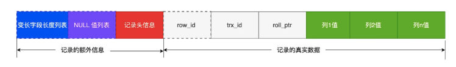

## 查看数据库文件 存放在哪个目录

show VARIABLES like 'datadir'


/usr/local/mysql/data/

```bash
ls: /usr/local/mysql/data/: Permission denied
 ~/FuRiIT/project/JavaNetty  main +2 !5 ?1  sudo ls /usr/local/mysql/data/                                                1 err  08:38:54 
Password:
#ib_16384_0.dblwr       binlog.000006           ca-key.pem              mysqld.local.err        sql_invoicing
#ib_16384_1.dblwr       binlog.000007           ca.pem                  mysqld.local.pid        sql_store
#innodb_redo            binlog.000008           client-cert.pem         performance_schema      study
#innodb_temp            binlog.000009           client-key.pem          private_key.pem         sys
auto.cnf                binlog.000010           ib_buffer_pool          public_key.pem          undo_001
binlog.000002           binlog.000011           ibdata1                 server-cert.pem         undo_002
binlog.000003           binlog.000012           ibtmp1                  server-key.pem          yupi
binlog.000004           binlog.index            mysql                   sql_hr
binlog.000005           book_manage             mysql.ibd               sql_inventory
 ~/FuRiIT/project/JavaNetty  main +2 !5 ?1    
```


一张数据库表的数据是保存在「 表名字.ibd 」的文件里的，这个文件也称为独占表空间文件。

https://xiaolincoding.com/mysql/base/row_format.html#%E8%A1%A8%E7%A9%BA%E9%97%B4%E6%96%87%E4%BB%B6%E7%9A%84%E7%BB%93%E6%9E%84%E6%98%AF%E6%80%8E%E4%B9%88%E6%A0%B7%E7%9A%84

COMPACT 行格式长什么样？

可以看到，一条完整的记录分为「记录的额外信息」和「记录的真实数据」两个部分

use  sql_hr;
CREATE TABLE 't_user' (
'id' int (11) NOT NULL, 
'name' VARCHAR (20) DEFAULT NULL, 
'phone' VARCHAR (20) DEFAULT NULL, 
'age' int (11) DEFAULT NULL, 
PRIMARY KEY ('id') using btree
) engine = innoDB default character set = ascii row_format = compact;

我会逐部分解析这条 MySQL 创建表的语句，重点讲解你关注的 `using btree` 和最后一行的含义，让你能清晰理解每个配置的作用。

### 语句整体功能
这条 SQL 语句的核心是**在 MySQL 中创建一个名为 `t_user` 的数据表**，用于存储用户的基础信息（ID、姓名、手机号、年龄），并定义了表的主键、存储引擎、字符集等关键属性。

### 逐部分解析
#### 1. 基础表结构定义
```sql
CREATE TABLE 't_user' (  -- 注意：这里单引号'是错误的，MySQL表名应使用反引号`或不加引号
    `id` int (11) NOT NULL,        -- 用户ID，整数类型，长度11，非空（必须有值）
    `name` VARCHAR (20) DEFAULT NULL,  -- 姓名，字符串类型，最大长度20，默认值NULL（可空）
    `phone` VARCHAR (20) DEFAULT NULL, -- 手机号，字符串类型，最大长度20，默认值NULL（可空）
    `age` int (11) DEFAULT NULL,       -- 年龄，整数类型，长度11，默认值NULL（可空）
    PRIMARY KEY (`id`) using btree    -- 主键约束 + 索引类型指定
) 
```
- 先修正一个小错误：表名 `'t_user'` 用单引号 `'` 是不符合 MySQL 语法的，正确写法是反引号 `` ` ``（即 `` `t_user` ``）或直接写 `t_user`（无特殊字符时）。
- 字段定义部分是基础：指定了字段名、数据类型、是否非空、默认值等。

#### 2. 重点1：`PRIMARY KEY (`id`) using btree`
- **`PRIMARY KEY (`id`)`**：将 `id` 字段设为该表的**主键**，主键的特性是：
  - 唯一性：表中每条记录的 `id` 不能重复；
  - 非空性：即使字段定义没写 `NOT NULL`，主键字段也会强制非空（这里 `id` 本身也显式写了 `NOT NULL`）；
  - 索引性：MySQL 会自动为主键创建**聚簇索引**（Clustered Index），加速基于 `id` 的查询。
- **`using btree`**：指定这个主键索引的**存储结构为 B 树（B-Tree）**：
  - B 树是 MySQL 中最常用的索引结构（默认就是 B 树），适合等值查询、范围查询（比如 `id > 10`）；
  - 对比：MySQL 还有 `using hash`（哈希索引），但哈希索引只适合等值查询，不支持范围查询，且 InnoDB 引擎不支持手动指定哈希索引（仅 Memory 引擎支持）；
  - 补充：`using btree` 可以省略，因为 InnoDB 主键默认就是 B 树索引。

#### 3. 重点2：最后一行 `engine = innoDB default character set = ascii row_format = compact`
这一行是表的**全局属性配置**，决定了表的存储方式、字符编码、行存储格式，逐部分解析：
| 配置项 | 含义 | 关键说明 |
|--------|------|----------|
| `engine = innoDB` | 指定表的存储引擎为 InnoDB | MySQL 最主流的引擎，支持事务、行级锁、外键、崩溃恢复，是生产环境的首选（对比 MyISAM 引擎，不支持事务和行锁，已基本淘汰） |
| `default character set = ascii` | 指定表的默认字符集为 ASCII | ASCII 字符集只包含英文字母、数字、常用符号，每个字符占 1 字节；<br>如果存储中文，需要改为 `utf8` 或 `utf8mb4`（utf8mb4 支持 emoji），这里用 ascii 说明该表只存英文/数字类数据 |
| `row_format = compact` | 指定行的存储格式为 COMPACT | InnoDB 的行存储格式，目的是**节省存储空间**：<br>- COMPACT：紧凑格式，会把字段的变长部分（如 VARCHAR）的前缀数据存到行数据中，后缀存到溢出页，是默认格式；<br>- 其他格式：`dynamic`（动态格式，溢出页存储更高效）、`compressed`（压缩格式，节省空间但查询稍慢） |

### 修正后的完整语句（修复语法错误）
```sql
use  sql_hr;
CREATE TABLE `t_user` (
    `id` int (11) NOT NULL,
    `name` VARCHAR (20) DEFAULT NULL,
    `phone` VARCHAR (20) DEFAULT NULL,
    `age` int (11) DEFAULT NULL,
    PRIMARY KEY (`id`) USING BTREE  -- USING BTREE 可省略，不影响功能
) ENGINE = InnoDB 
  DEFAULT CHARACTER SET = ascii 
  ROW_FORMAT = COMPACT;
```

### 总结
1. `using btree` 是指定主键索引的存储结构为 B 树（InnoDB 主键默认值，可省略），适合大部分查询场景；
2. 最后一行的配置是表的核心属性：InnoDB 引擎保证事务和数据安全，ASCII 字符集适配英文/数字存储，COMPACT 格式节省空间；
3. 小细节：表名不能用单引号 `'`，需用反引号 `` ` `` 或不加引号，这是 MySQL 的语法规范。