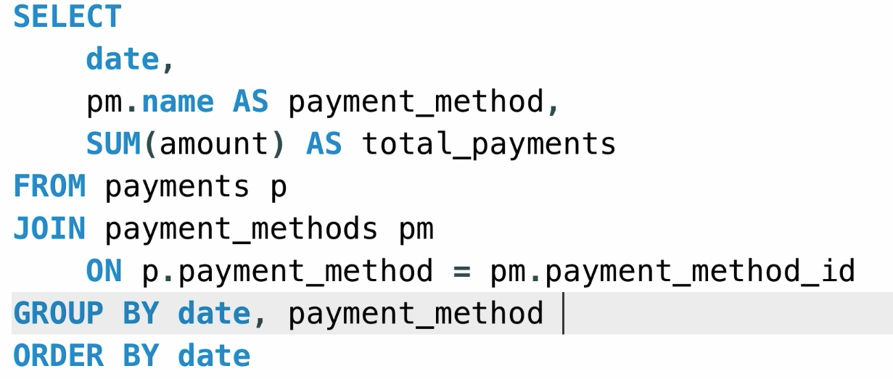

# 复习 

## 重新过一遍 牛客网的sql快速入门

group by可以去重？

在 SQL 里，GROUP BY 本身就具有“去重”的效果，不过它是按分组字段去重，而不是对整行随意去重

```sql
SELECT department
FROM employee
GROUP BY department;
```

等价于

```sql
select distinct department
from employee;
```

```sql
select
device_id,gender,age,university
from user_profile
where university not in ('复旦大学');
```

# like运算符

**模糊查找，查找具有某种模式的字符串的记录/行**

引号内描述想要的字符串模式，注意SQL任何情况都是不区分大小写的
- % 任何个数（包括0个）的字符（类似通配符里的 *）
- _ 单个字符（类似通配符里的 ?）

```sql
select *
from user_profile
where university like '%北京__'
```

# 数值函数相关

```sql
SELECT ROUND(5.7365, 2) -- 四舍五入
SELECT TRUNCATE(5.7365, 2) -- 截断
SELECT CEILING(5.2) -- 天花板函数，大于等于此数的最小整数
SELECT FLOOR(5.6) -- 地板函数，小于等于此数的最大整数
SELECT ABS(-5.2) -- 绝对值
SELECT RAND() -- 随机函数，0到1的随机值
```
```sql
select 
round(max(gpa),10)
from
user_profile
```

如果我想取gpa最高的那一行 应该怎么取

**老老实实用子查询**


WHERE 是在 分组和聚合之前执行
聚合函数只能出现在：
SELECT
HAVING
子查询

```sql
select
    *
from
    user_profile
where
    gpa = (
        select
            max(gpa)
        from
            user_profile
    );
```

# count函数 和 if函数组合

根据是否满足条件返回不同的值:
IF(条件表达式, 返回值1, 返回值2) 返回值可以是任何东西，数值、文本、日期时间、空值null均可


SELECT
    COUNT(IF(gender = 'male', 1, NULL))
FROM user_profile;

- IF(gender = 'male', 1, NULL)
- COUNT(expr) 只统计非 NULL 的值
- 男性 → 返回 1 → 被统计
- 非男性 → 返回 NULL → 不统计

# 聚合函数

输入一系列值并聚合为一个结果的函数

```sql
SELECT
MAX(invoice_date) AS latest_date,
-- SELECT选择的不仅可以是列，也可以是数字、列间表达式、列的聚合函数
MIN(invoice_total) lowest,
AVG(invoice_total) average,
SUM(invoice_total * 1.1) total,
COUNT(*) total_records,
COUNT(invoice_total) number_of_invoices,
-- 和上一个相等
COUNT(payment_date) number_of_payments,
-- 聚合函数会忽略空值，支付数少于发票数
【COUNT(DISTINCT client_id) number_of_distinct_clients】
-- DISTINCT client_id筛掉了该列的重复值，再COUNT计数，不同顾客数
FROM invoices
WHERE invoice_date > '2019-07-01' -- 想只统计下半年的结果
```

**你在用聚合函数 COUNT()，但又想把“每一行的全部字段”一起查出来**

这是 SQL 的硬性规则：

只要 SELECT 里出现聚合函数，
那么：

- 要么所有字段都要参与聚合

- 要么必须出现在 GROUP BY 中

而：

* 代表 每一行的所有列

COUNT() 是 把多行压缩成一行

👉 这两件事在逻辑上是冲突的。


合法的写法：

SELECT
    gender,
    COUNT(*) AS cnt
FROM user_profile
GROUP BY gender;


1️⃣COUNT(*) —— 数“行数”

不关心某一列是否为 NULL

只要这一行存在，就 +1

2️⃣ COUNT(gender) —— 数“gender 不为 NULL 的行”

如果某一行 gender IS NULL

这一行 不会被统计


## group by子句的理解 还不到位

> SELECT 里出现的非聚合字段，
> 必须出现在 GROUP BY 中（或能被唯一确定）



```sql
select 
   university,
   device_id,
    count(*)
from user_profile
group by university,device_id
```

**SELECT 里出现的非聚合字段，**
**必须出现在 GROUP BY 中（或能被唯一确定）**

```sql
select
gender,
university,
count(device_id) as user_num,
avg(active_days_within_30) as avg_active_day,
avg(question_cnt) as avg_question_cnt
from user_profile
group by gender,university
order by gender,university
```
