# sql复习

## case when 的用法

当分类多于两种时，可以用IF嵌套，也可以用CASE语句，后者可读性更好

ELSE 'Future' 是可选的，实验发现若分类不完整，比如只写了今年和去年的两个分类条件，则不在这两个分类的
记录的category字段会得到是null（当然）.

```sql
SELECT
order_id,
CASE
WHEN YEAR(order_date) = YEAR(NOW()) THEN 'Active'
WHEN YEAR(order_date) = YEAR(NOW()) - 1 THEN 'Last Year'
WHEN YEAR(order_date) < YEAR(NOW()) - 1 THEN 'Achived'
[ELSE 'Future']
END AS 'category'
FROM orders
```

```sql
select
device_id,gender,
    case
        when age<20 then '20岁以下'
        when age>=20 and age<=24 then '20-24岁'
        when age>=25 then '25岁及以上'
        else '其他'
    end as age_cut
from
user_profile
```

# 字符串函数

依然介绍最常用的字符串函数： 
1. LENGTH, UPPER, LOWER 
2. TRIM, LTRIM, RTRIM 
3. LEFT, RIGHT, SUBSTRING 
4. LOCATE, REPLACE, 【CONCAT】 
查看全部搜索关键词 'mysql string functions'

长度、转大小写：
SELECT LENGTH('sky') -- 字符串字符个数/长度（LENGTH）
SELECT UPPER('sky') -- 转大写
SELECT LOWER('Sky') -- 转小写

修剪：用户输入时时常多打空格，下面三个函数用于处理/修剪（trim）字符串前后的空格，L、R 表示 LEFT、
RIGHT：
SELECT LTRIM(' Sky')
SELECT RTRIM('Sky ')
SELECT TRIM(' Sky ')

切片（提取）：
```sql
SELECT LEFT('Kindergarden', 4) -- 取左边（LEFT）4个字符
SELECT RIGHT('Kindergarden', 6) -- 取右边（RIGHT）6个字符
SELECT SUBSTRING('Kindergarden', 7, 6)
-- 取从第7个开始的长度为6的子串（SUBSTRING）
-- 【注意SQL是从第1个（而非第0个）开始计数的】
-- 【省略第3参数（子串长度）则一直截取到最后】
```

### SUBSTRING_INDEX

-- sql字段内如何截取字符？
-- SUBSTRING_INDEX 是 SQL 中用于根据指定分隔符和出现次数截取字符串的函数
SELECT SUBSTRING_INDEX('user@example.com', '@', -1);  
-- 返回 'example.com'
SELECT SUBSTRING_INDEX('/home/user/file.txt', '/', 3);  
-- 返回 '/home/user'
SELECT SUBSTRING_INDEX('A|B|C', '|', 2);  
-- 返回 'A|B'（第2个分隔符前）
SELECT SUBSTRING_INDEX('A|B|C', '|', -2);  
-- 返回 'B|C'（倒数第2个分隔符后）


定位：
SELECT LOCATE('gar', 'Kindergarden') -- 定位（LOCATE）首次出现的位置
-- 【没有的话返回0（其他编程语言大多返回-1，可能因为索引是从0开始的）】
-- 【这个定位/查找函数依然是不区分大小写的】

替换：
SELECT REPLACE('Kindergarten', 'garten', 'garden');


连接：
con`catenate v. 连接，连结

SELECT CONCAT(first_name, ' ', last_name) AS full_name
FROM customers

自己尝试
**有个小问题需要注意，这里一定要用反引号才可以**
```sql
select 
left(`date`,7)
from
question_practice_detail;
```

//28
```sql
select 
right(`date`,2) as day, --此处也可以使用day函数 day(`date`) as day
count(question_id) as question_cnt
from
question_practice_detail
where 
left(`date`,7) = '2021-08'
group by 1;
```

## 计算日期和时间的函数

有时需要对日期事件对象进行运算，如增加一天或算两个时间的差值之类，介绍一些最有用的日期时间计算函数： 
1. DATE_ADD, DATE_SUB 
2. DATEDIFF 
3. TIME_TO_SEC

增加或减少一定的天数、月数、年数、小时数等等

SELECT DATE_ADD(NOW(), 【INTERVAL -1 DAY】)
SELECT DATE_SUB(NOW(), INTERVAL 1 YEAR)

计算日期差异
SELECT DATEDIFF('2019-01-01 09:00', '2019-01-05')
-- -4
-- 会忽略时间部分，【只算日期差异】
-- 再次注意手写日期要加引号

借助 TIME_TO_SEC 函数计算时间差异，TIME_TO_SEC 会计算从 00:00 到某时间经历的秒
SELECT TIME_TO_SEC('09:00') -- 32400
SELECT TIME_TO_SEC('09:00') - TIME_TO_SEC('09:02') -- -120

## group by

按一列或多列分组，注意语句的位置

```sql
with temp as (
    select device_id,date
    from question_practice_detail
    group by device_id,date
)

select
count(b.device_id)/count(a.device_id)
from temp  as a
left join temp as b
using(device_id)
where adddate(a.date,interval 1 day) = b.date;
```

//33

-- 先拿到每个学校的最低gpa

select
university,
min(gpa)
from user_profile
group by university;

```sql
--构建临时表
with t1 as (
    select
university,
min(gpa) as gpa
from user_profile
group by university
)
select 
device_id,
t1.university,
t1.gpa
from t1
left join user_profile as b
on t1.university = b.university
and t1.gpa = b.gpa
order by t1.university;
```

## 窗口函数

窗口函数是在原有表格的基础上，新生成一个列，这个列包含了基于某些计算或统计的结果，而不影响原有数据的行

举个简单的例子

假设你有一个员工表，记录了每个员工的销售额：

员工ID	销售额
1	500
2	600
3	700
4	550

你现在想在这个表中新增一列，显示每个员工的销售额排名，并且不影响原表中的其他数据。
这时你可以使用窗口函数来实现。

使用窗口函数来排名
SELECT 
    员工ID,
    销售额,
    RANK() OVER (ORDER BY 销售额 DESC) AS 销售额排名
FROM 员工销售;

结果：
员工ID	销售额	销售额排名
3	700	1
2	600	2
4	550	3
1	500	4

在这里，我们没有改变原有的表格，只是新增了一个销售额排名的列。每一行的数据都保留原样，并且窗口函数给每行加上了一个计算值。

小结：

窗口函数是对表格中每一行数据进行计算，并且新生成一个列，而不改变原有数据的结构。
你可以用它来做排名、累积求和、滑动平均等计算，十分方便。

https://www.bilibili.com/video/BV1jG411M7hr/?spm_id_from=333.337.search-card.all.click&vd_source=4fd29620ab97a080af7ee392e19b0fcb

-- over是窗口函数？？
https://www.bilibili.com/video/BV1tzxyzREXP/?spm_id_from=333.337.search-card.all.click&vd_source=4fd29620ab97a080af7ee392e19b0fcb

select * ,sum(quantity) over (partition by product_id) from sales;
--窗口函数 保持原本的sql行数不变 去新增一个列
--partition by 分组依据
```sql
SELECT 
    column1, 
    column2,
    SUM(column_to_sum) OVER (
        [PARTITION BY partition_expression] //这个是分组
        [ORDER BY sort_expression [ASC | DESC]] //这个是排序
        range between xxx and xxx //分组后求子集
    ) AS sum_result
FROM table_name;
--  简单累计求和
SELECT 
    date,
    sales,
    SUM(sales) OVER (ORDER BY date) AS running_total
FROM sales_data;
-- 这个查询会按日期顺序计算销售总额的累计值。

select * ,sum(quantity) over (partition by product_id) from sales;
```

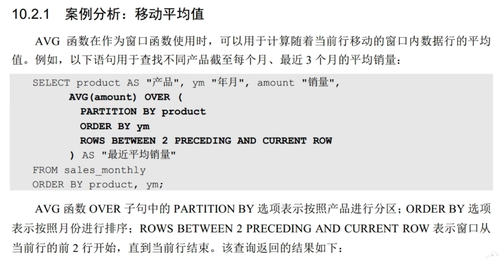

窗口函数例子 41题

```sql
select
profit_id,
profit_date,
profit,
sum(profit) over(
    order by profit_date
) as cumulative_profit
from daily_profits;
```

### 窗口函数 移动平均值 和 累积求和

**移动平均值**
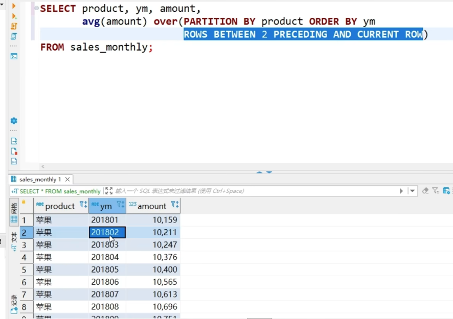
这段SQL语句通过`window function`的方式，计算了每个产品（`product`）在指定时间范围（按年月 `ym` 排序）内的某个金额（`amount`）的平均值。

```sql
select product,ym,amount,
avg(amount) over (partition by product order by ym
rows between 2 preceding and current row)
from sales_monthly;
```
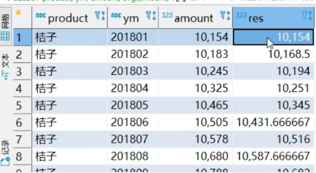

####  具体的解释：

* **SELECT**: 选择需要查询的字段。这里查询了 `product`（产品）、`ym`（年月）和 `amount`（销售金额）字段。

* **avg(amount) over(...)**: 计算 `amount` 字段的平均值。这个 `avg` 不是一个普通的聚合函数，而是与`window function`结合使用，在窗口内进行计算，返回每行的一个计算结果。

* **PARTITION BY product**: 这个部分会将查询的数据按照 `product`（产品）进行分组。每个产品的销售数据会作为一个单独的“窗口”进行处理，计算每个窗口内的平均值。

* **ORDER BY ym**: 这是对数据进行排序的方式，按 `ym`（年月）进行升序排序。这个排序决定了在计算平均值时如何确定窗口的顺序。

* **ROWS BETWEEN 2 PRECEDING AND CURRENT ROW**: 这是一个非常关键的部分，它定义了每个窗口的范围。意思是：

  * 对于每一行，窗口将包含当前行和前面2行的数据。
  * 换句话说，每个产品的每个月，计算的是当前月和前两个月（包括当前月）的 `amount` 的平均值。

### 结果的含义：

* 查询结果会展示每个产品在每个月的销售金额，并且每个月都会有一个基于前两个月（包括当前月）的 `amount` 平均值。
  比如：
  * 对于 `201802`（2018年2月），它会显示2018年2月的 `amount` 和2018年1月、2月、3月这三个月份的平均销售金额。

通过这样的分析，可以用来观察产品在不同时间段内的销售趋势。

**累积销量**

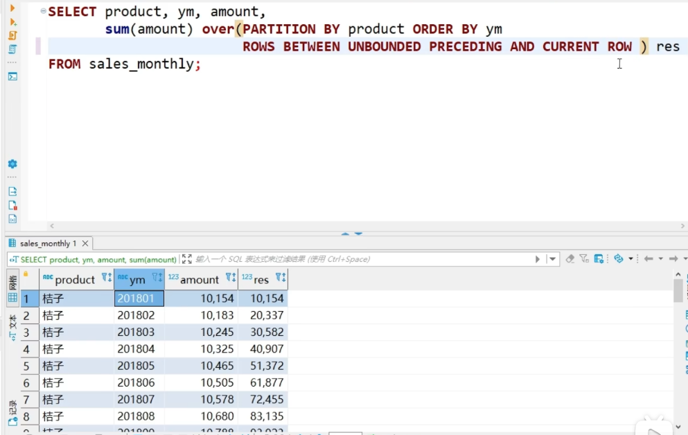

等价于
```sql
select product,ym,amount,
sum(amount) over (partition by product order by ym)
from sales_monthly;
```

第三个参数的具体解析

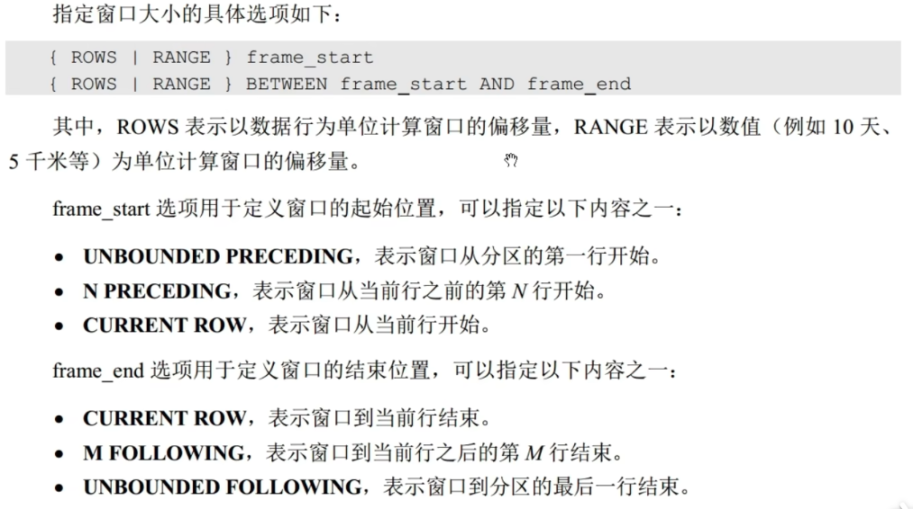

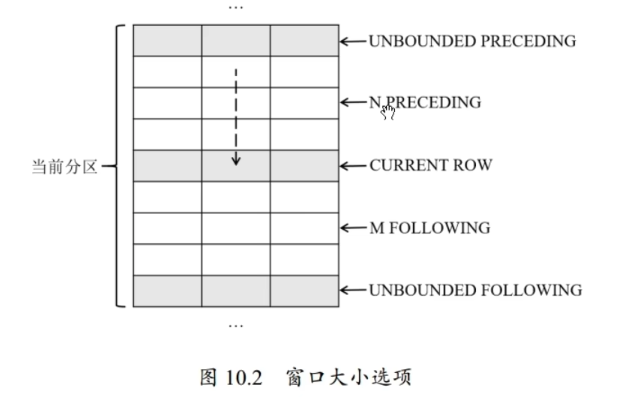

//34题

错误解法
```sql
with t1 as (
    select
    a.device_id,a.question_id,a.result,a.date,b.university
    from question_practice_detail as a
    left join user_profile as b
    using (device_id)
    where university = '复旦大学'
)
select
device_id,
university,
count(distinct question_id) as question_cnt,
count(if(result= 'right',1,null)) as right_question_cnt
from t1 
group by device_id,university
;
```

//39
```sql
select
count(distinct device_id) as did_cnt
,count(1) as question_cnt
from question_practice_detail
where left(`date`, 7) = '2021-08'

```

### 窗口函数 分类排名 和 累积分布

#### 分类排名
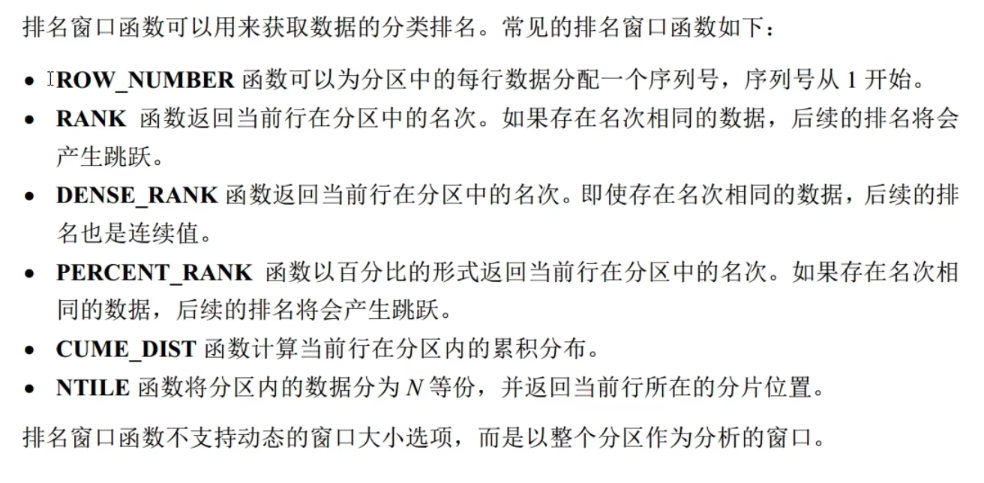

需要按照 partition by的分区 去进行排名

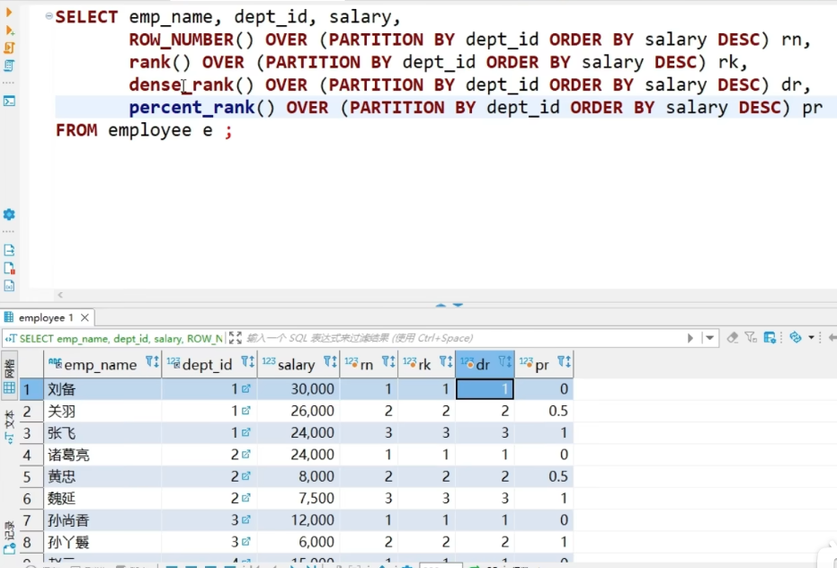

```sql
select emp_name,dept_id,salary,
    row_number() over(partition by dept_id order by salary desc) as rn,
    rank() over(partition by dept_id order by salary desc) as rk,
    dense_rank() over(partition by dept_id order by salary desc) as dr,
    present_rank() over(partition by dept_id order by salary desc)as pr
from employee e;
```
1️⃣ 整体作用一句话

在每个部门（dept_id）内部，按工资（salary）从高到低，对员工进行多种“排名计算”。

这是一个典型的窗口函数（Window Function）对比示例，用来同时展示
row_number / rank / dense_rank / percent_rank 的区别。

上面的sql等价于
```sql
SELECT
    emp_name,
    dept_id,
    salary,
    ROW_NUMBER()   OVER w AS rn,
    RANK()         OVER w AS rk,
    DENSE_RANK()   OVER w AS dr,
    PERCENT_RANK() OVER w AS pr
FROM employee e
WINDOW w AS (
    PARTITION BY dept_id
    ORDER BY salary DESC
);
-- 这个window需要放到查询的后面定义
```

#### 累积分布
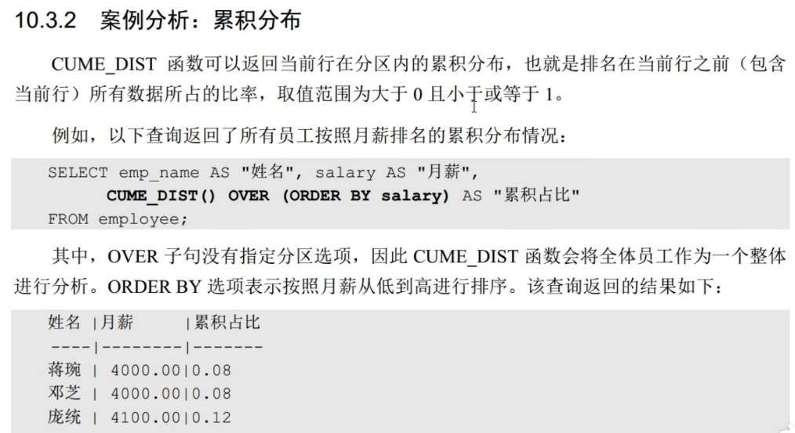


## REGEXP运算符

正则表达式，在搜索字符串方面更为强大，可搜索更复杂的模板

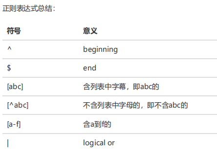
```sql
select
    id,
    name,
    phone_number
from
    contacts
where
    phone_number REGEXP '^[1-9][0-9]{2}-?[0-9]{3}-?[0-9]{4}$';

select * from customers
where last_name like '%field%'

--等价于
where last_name regexp 'field'

```


## 基本数学函数

//42
```sql
select
    *,
    abs(value) as absolute_value,
    ceil(value) as ceiling_value, # 向上取整
    floor(value) as floor_value, # 向下取整
    round(value, 1) as rounded_value
from
    numbers
order by
    id
```


//35
自己写的
```sql
with
    t1 as (
        select
            a.device_id as device_id,
            a.question_id as question_id,
            a.result as result,
            b.university,
            c.difficult_level as difficult_level
        from
            question_practice_detail as a
            left join user_profile as b using (device_id)
            left join question_detail as c using (question_id)
        where
            b.university = '浙江大学'
    )
select
difficult_level,
count(if(result='right',1,null))/count(question_id)
from t1
group by 1;
```

## mysql 6大约束

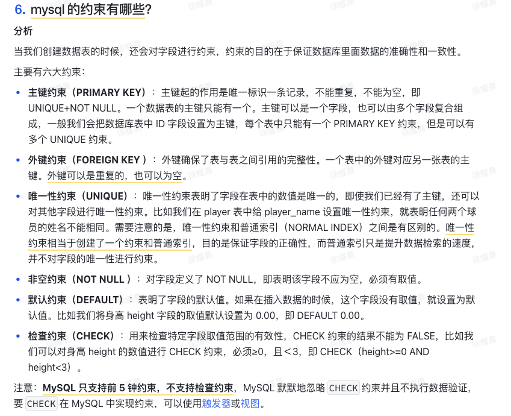

下面是我将**图片中的内容完整转成的文字版**（保持原意与结构，便于你直接复制使用）👇

---

## 6. MySQL 的约束有哪些？

### 分析

当我们创建数据库的时候，还会对字段进行约束，约束的目的在于保证数据库里面数据的准确性和一致性。

主要有六大约束：

---

### 1️⃣ 主键约束（PRIMARY KEY）

主键起的作用是唯一标识一条记录，不能重复，不能为空，即 **UNIQUE + NOT NULL**。
一个数据表的主键只能有一个。主键可以是一个字段，也可以由多个字段复合组成。
一般我们会把数据库表中 `id` 字段设置为主键。
每个表中只能有一个 PRIMARY KEY 约束，但是可以有多个 UNIQUE 约束。

---

### 2️⃣ 外键约束（FOREIGN KEY）

外键确保了表与表之间引用的完整性。
一个表中的外键对应另一张表的主键。
外键可以是重复的，也可以为空。

---

### 3️⃣ 唯一性约束（UNIQUE）

唯一性约束表明了字段在表中的数值是唯一的。
即使我们已经有了主键，还可以对其他字段进行唯一性约束。

比如我们在 `player` 表中给 `player_name` 设置唯一性约束，就表明任何两个球员的姓名不能相同。

需要注意的是：
**唯一性约束和普通索引（NORMAL INDEX）之间是有区别的**。
唯一性约束相当于创建了一个约束和普通索引，目的是保证字段的正确性；
而普通索引只是提高数据检索的速度，并不对字段的唯一性进行约束。

---

### 4️⃣ 非空约束（NOT NULL）

对字段定义了 NOT NULL，即表明该字段不能为空，必须有取值。

---

### 5️⃣ 默认约束（DEFAULT）

表明了字段的默认值。
如果在插入数据的时候，这个字段没有赋值，就设置为默认值。

比如我们将身高 `height` 字段的取值默认设置为 `0.00`，即 `DEFAULT 0.00`。

---

### 6️⃣ 检查约束（CHECK）

用来检查特定字段取值范围的有效性，CHECK 约束的结果不能为 FALSE。

比如我们可以对身高 `height` 的数值进行 CHECK 约束，
必须 ≥ 0 且 < 3，即：

```sql
CHECK (height >= 0 AND height < 3)
```

---

### 注意：

**MySQL 只支持前 5 种约束，不支持检查约束（CHECK）**。
MySQL 默认也忽略 CHECK 约束并且不执行数据验证。
如果要在 MySQL 中实现类似 CHECK 的约束，可以使用 **触发器或视图**。

---

## 脏读 不可重复读 幻读

• 脏读：读到其他事务未提交的数据；
• 不可重复读：前后读取的数据不一致；
• 幻读：前后读取的记录数量不一致。

https://xiaolincoding.com/mysql/transaction/mvcc.html#%E5%B9%BB%E8%AF%BB


## 如何使用Workbench生成特定数据库的E-R图

https://www.bilibili.com/video/BV1PG411H7nh/?spm_id_from=333.337.search-card.all.click&vd_source=4fd29620ab97a080af7ee392e19b0fcb


